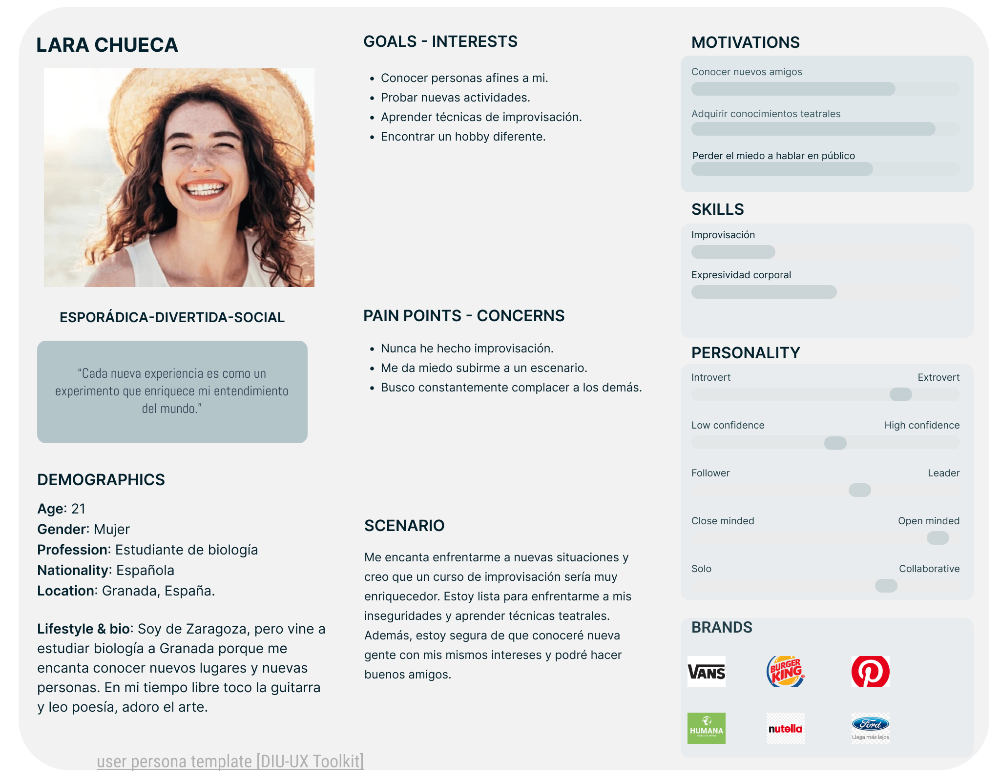
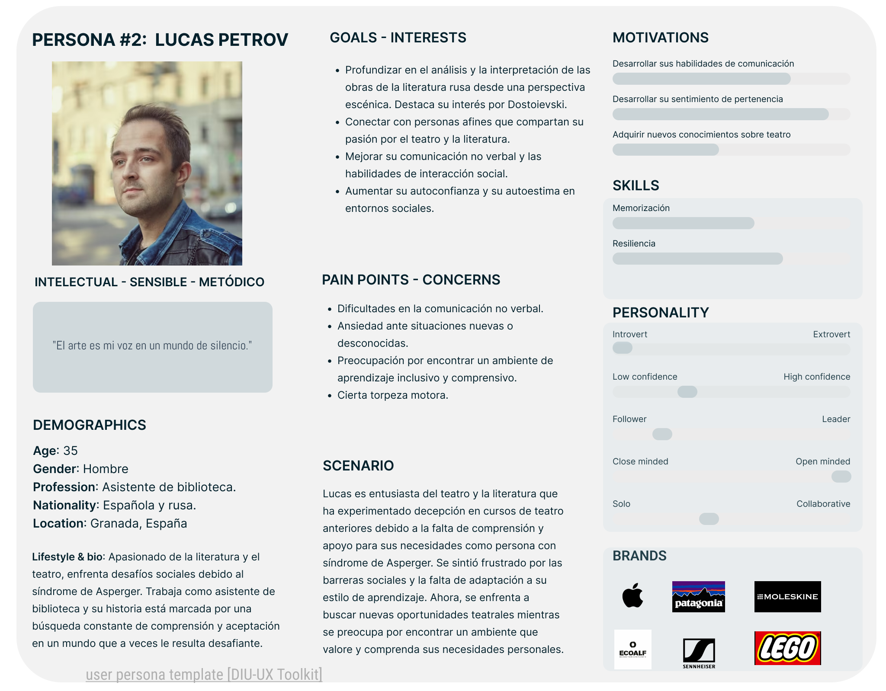

# DIU24
Prácticas Diseño Interfaces de Usuario 2023-24 (Tema: .... ) 

Grupo: DIU1_UX!-I-did-it-again.  Curso: 2023/24 
Updated: 16/3/2024

Proyecto: 
>>> Decida el nombre corto de su propuesta en la práctica 2 

Descripción: 

>>> Describa la idea de su producto en la práctica 2 

Logotipo: 
>>> Opcionalmente si diseña un logotipo para su producto en la práctica 3 pongalo aqui

Miembros
 * :bust_in_silhouette:   Mario López Quesada     :octocat:     
 * :bust_in_silhouette:  Julia María Cano Flores     :octocat:

----- 

# Proceso de Diseño 

## Paso 1. UX User & Desk Research & Analisis 

 **1.a User Reseach Plan**
-----

>>>  Con este documento hemos podido establecer unos objetivos claros que nos motiven a hacer este estudio. Además, hemos especificado las herramientas que vamos a utilizar para evaluar la usabilidad y poder encontrar posibles mejoras. Entre ellas, podemos destacar la etnografía y las encuestas de usabilidad. Nos centraremos en mejorar la utilidad, aprendizaje, satisfacción y persuasión del diseño del sitio web, ya que son cruciales a la hora de obtener unos beneficios. Con todo esto y habiendo analizado los posibles clientes de la web a evaluar, procederemos con cada una de las partes de este estudio. 

 1.b Competitive Analysis
-----

>>>  Para realizar el análisis de competidores, hemos elegido otras dos compañías de teatro que ofrecen servicios similares a los que ofrece el Espacio La Estupenda. El primero es La Petite, un grupo de artes escénicas de Granada. La elegimos porque consideramos que comparándola con ella, La Estupenda podría sacar a relucir sus virtudes, ya que el contenido aparece bastante desorganizado y es de difícil acceso, además de contar con una velocidad de navegación muy lenta. Por otro lado, elegimos el Espacio La Ventana, una compañía de formación teatral en Madrid, que consideramos, cuenta con una página web bastante buena, y cuyas virtudes podrían servir como referentes a la hora de determinar las debilidades de la página web de La Estupenda. En conclusión, podríamos decir que la comparación acabó siendo fructífera, al evidenciar aquellos aspectos de La Estupenda que necesitan - más o menos urgentemente - intervención o rediseño, entre ellos, la velocidad de carga de la interfaz o la interacción entre el usuario y esta.

 1.c Persona
-----

>>> Persona 1 - Lara: Hemos decidido representar a una estudiante de 21 años ya que representa una gran parte del público potencial de dicha empresa. Es usual que los estudiantes busquen actividades diferentes con las que poder despejarse y salir de la rutina. Por ello mismo, hemos decidido que era importante incluir una persona de estas características en nuestro estudio. 

>>> Persona 2 - Lucas: Como segunda persona, decidimos representar a Lucas Petrov, un asistente de biblioteca de 35 años apasionado por la literatura. Lucas sufre síndrome de Asperger, lo que dificulta su integración social en diferentes ámbitos, como los grupos de teatro. Ya ha tenido experiencias negativas en este aspecto, y se siente un poco reticente ante la idea de volver a intentarlo, pero es consciente de que si encuentra una buena compañía que ofrezca contenidos adaptados a sus necesidades, su capacidad de interacción social y su ansiedad ante situaciones en las que pueda estar condicionado por su síndrome disminuirán.

 1.d User Journey Map
----

>>> Journey map Lara: Este journey map representa el procedimiento de cómo reservar una entrada para un espectáculo del Espacio La Estupenda. Como hemos podido observar, 
al intentar reservar la entrada para el espectáculo, Lara no consigue hacerlo ya que no se encuentra disponible la venta de entradas en ese momento. Esto muestra que la página está desactualizada y no ofrece los servicios que promete. 

>>> Journey map Lucas: El journey map de Lucas representa su intento - fructífero tras algunas decepciones - de reservar un curso de Iniciación a lmprovisación. Consideramos que es interesante ya que evidencia lo ortopédico del proceso de reserva, que necesariamente ha de realizarse mediante formularios, la poca información relativa a la inclusión de personas con necesidades especiales que se incluye en las descripciones de los talleres, y la ansiedad que puede provocar el hecho de no recibir una respuesta inmediata la hora de reservar, ya que siquiera se muestran las plazas disponibles en los talleres.

 1.e Usability Review
----

>>> - Enlace al documento:  [Usability Review](P1/Usability%20review%20-%20La%20Estupenda.xlsx%20-%20Usability%20scores.pdf)
>>> - Valoración final (numérica): 63 - Moderate
>>> - Comentario sobre la valoración:  Nuestro análisis de la web del Espacio La Estupenda identifica áreas críticas a mejorar. La barra de navegación carece de consistencia, dificultando la búsqueda de información. Para reservar cursos, los usuarios se ven obligados a completar un formulario de contacto y esperar una respuesta, en lugar de ofrecer un método de reserva directa. Además, la interfaz de la tienda online, junto con algunas de sus funciones, como la creación de cuentas de usuario, presenta discrepancias con el resto del sitio, lo que puede causar confusión entre los usuarios. La visualización de eventos sin entradas disponibles resulta poco clara. La lentitud del sitio y la falta de opción para crear una cuenta directamente son preocupaciones adicionales. Consideramos que se requiere una revisión integral para garantizar una experiencia de usuario más fluida y satisfactoria.

## Paso 2. UX Design  

 2.a Reframing / IDEACION: Feedback Capture Grid / EMpathy map 
----

>>> Comenta con un diagrama los aspectos más destacados a modo de conclusion de la práctica anterior,

 Interesante | Críticas     
| ------------- | -------
  Preguntas | Nuevas ideas
  
    
>>> ¿Que planteas como "propuesta de valor" para un nuevo diseño de aplicación para economia colaborativa ?
>>> Problema e hipótesis
>>>  Que planteas como "propuesta de valor" para un nuevo diseño de aplicación para economia colaborativa te
>>> (150-200 caracteres)

 2.b ScopeCanvas
----
>>> Propuesta de valor 

 2.b User Flow (task) analysis 
-----

>>> Definir "User Map" y "Task Flow" ... 

 2.c IA: Sitemap + Labelling 
----

>>> Identificar términos para diálogo con usuario  

Término | Significado     
| ------------- | -------
  Login¿?  | acceder a plataforma

 2.d Wireframes
-----

>>> Plantear el  diseño del layout para Web/movil (organización y simulación ) 

## Paso 3. Mi UX-Case Study (diseño)

 3.a Moodboard
-----

>>> Plantear Diseño visual con una guía de estilos visual (moodboard) 
>>> Incluir Logotipo
>>> Si diseña un logotipo, explique la herramienta utilizada y la resolución empleada. ¿Puede usar esta imagen como cabecera de Twitter, por ejemplo, o necesita otra?

  3.b Landing Page
----

>>> Plantear Landing Page 

 3.c Guidelines
----

>>> Estudio de Guidelines y Patrones IU a usar 
>>> Tras documentarse, muestre las deciones tomadas sobre Patrones IU a usar para la fase siguiente de prototipado. 

  3.d Mockup
----

>>> Layout: Mockup / prototipo HTML  (que permita simular tareas con estilo de IU seleccionado)

 3.e ¿My UX-Case Study?
-----

>>> Publicar my Case Study en Github..
>>> Documente y resuma el diseño de su producto

## Paso 5. Exportación & evaluación con Eye Tracking 

Exportación a HTML/Flutter
-----

)  5.b Eye Tracking method 

>>> Indica cómo diseñas experimento y reclutas usuarios (uso de gazerecorder.com)  

Diseño del experimento 
----

>> Uso de imágenes (preferentemente) -> hay que esablecer una duración de visualización y  
>> fijar las áreas de interes (AoI) antes del diseño. Planificar qué tarea debe hacer el usuario (buscar, comprar...) 

  
>> cambiar img por tu diseño de experimento  

>> Recordar que gazerecorder es una versión de pruebas: usar sólo con 3 usuarios para generar mapa de calor (recordar que crédito > 0 para que funcione) 

Resultados y valoración 
-----

>> Cambiar por tus resultados
  

## Paso 4. Evaluación 

 4.a Caso asignado
----

>>> Breve descripción del caso asignado con enlace a  su repositorio Github

 4.b User Testing
----

>>> Seleccione 4 personas ficticias. Exprese las ideas de posibles situaciones conflictivas de esa persona en las propuestas evaluadas. Asigne dos a Caso A y 2 al caso B
 

| Usuarios | Sexo/Edad     | Ocupación   |  Exp.TIC    | Personalidad | Plataforma | TestA/B
| ------------- | -------- | ----------- | ----------- | -----------  | ---------- | ----
| User1's name  | H / 18   | Estudiante  | Media       | Introvertido | Web.       | A 
| User2's name  | H / 18   | Estudiante  | Media       | Timido       | Web        | A 
| User3's name  | M / 35   | Abogado     | Baja        | Emocional    | móvil      | B 
| User4's name  | H / 18   | Estudiante  | Media       | Racional     | Web        | B 

 4.c Cuestionario SUS
----

>>> Usaremos el **Cuestionario SUS** para valorar la satisfacción de cada usuario con el diseño (A/B) realizado. Para ello usamos la [hoja de cálculo](https://github.com/mgea/DIU19/blob/master/Cuestionario%20SUS%20DIU.xlsx) para calcular resultados sigiendo las pautas para usar la escala SUS e interpretar los resultados
http://usabilitygeek.com/how-to-use-the-system-usability-scale-sus-to-evaluate-the-usability-of-your-website/)
Para más información, consultar aquí sobre la [metodología SUS](https://cui.unige.ch/isi/icle-wiki/_media/ipm:test-suschapt.pdf)

>>> Adjuntar captura de imagen con los resultados + Valoración personal 

 4.d Usability Report
----

>> Añadir report de usabilidad para práctica B (la de los compañeros)

>>> Valoración personal 

5.) Conclusion de EVALUACION (A/B testing + usability report + eye tracking) 
----

>> recupera el usability report de tu práctica (que es el caso B de los asignados a otros grupos) 
>> con los resultados del A/B testing, de eye tracking y del usability report:
>>  comentad en 2-3 parrafos cual es la conclusion acerca de la realización de la práctica y su evaluación con esas técnicas y que habéis aprendido

## Conclusión final / Valoración de las prácticas

>>> (90-150 palabras) Opinión FINAL del proceso de desarrollo de diseño siguiendo metodología UX y valoración (positiva /negativa) de los resultados obtenidos  

