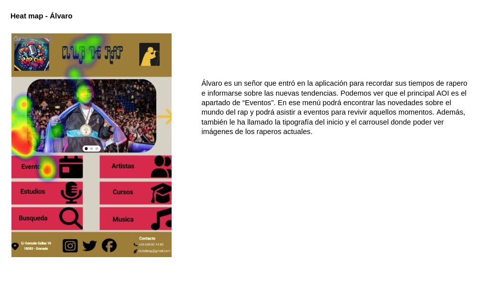

# DIU24
Prácticas Diseño Interfaces de Usuario 2023-24 (Tema: .... ) 

Grupo: DIU1_UX!-I-did-it-again.  Curso: 2023/24 
Updated: 16/3/2024

Proyecto: 
>>> Decida el nombre corto de su propuesta en la práctica 2 

Descripción: 

>>> Describa la idea de su producto en la práctica 2 

Logotipo: 
>>> Opcionalmente si diseña un logotipo para su producto en la práctica 3 pongalo aqui

Miembros
 * :bust_in_silhouette:   Mario López Quesada     :octocat:     
 * :bust_in_silhouette:  Julia María Cano Flores     :octocat:

----- 

# Proceso de Diseño 

## Paso 1. UX User & Desk Research & Analisis 

 **1.a User Reseach Plan**
-----

>>>  Con este documento hemos podido establecer unos objetivos claros que nos motiven a hacer este estudio. Además, hemos especificado las herramientas que vamos a utilizar para evaluar la usabilidad y poder encontrar posibles mejoras. Entre ellas, podemos destacar la etnografía y las encuestas de usabilidad. Nos centraremos en mejorar la utilidad, aprendizaje, satisfacción y persuasión del diseño del sitio web, ya que son cruciales a la hora de obtener unos beneficios. Con todo esto y habiendo analizado los posibles clientes de la web a evaluar, procederemos con cada una de las partes de este estudio. 
>>>  Enlace al archivo: [User Research Plan](P1/User%20Research%20Plan.pdf).

 1.b Competitive Analysis
-----

>>>  Para realizar el análisis de competidores, hemos elegido otras dos compañías de teatro que ofrecen servicios similares a los que ofrece el Espacio La Estupenda. El primero es La Petite, un grupo de artes escénicas de Granada. La elegimos porque consideramos que comparándola con ella, La Estupenda podría sacar a relucir sus virtudes, ya que el contenido aparece bastante desorganizado y es de difícil acceso, además de contar con una velocidad de navegación muy lenta. Por otro lado, elegimos el Espacio La Ventana, una compañía de formación teatral en Madrid, que consideramos, cuenta con una página web bastante buena, y cuyas virtudes podrían servir como referentes a la hora de determinar las debilidades de la página web de La Estupenda. En conclusión, podríamos decir que la comparación acabó siendo fructífera, al evidenciar aquellos aspectos de La Estupenda que necesitan - más o menos urgentemente - intervención o rediseño, entre ellos, la velocidad de carga de la interfaz o la interacción entre el usuario y esta.

 1.c Persona
-----

>>> **Persona 1 - Lara**: Hemos decidido representar a una estudiante de 21 años ya que representa una gran parte del público potencial de dicha empresa. Es usual que los estudiantes busquen actividades diferentes con las que poder despejarse y salir de la rutina. Por ello mismo, hemos decidido que era importante incluir una persona de estas características en nuestro estudio. 

>>> **Persona 2 - Lucas**: Como segunda persona, decidimos representar a Lucas Petrov, un asistente de biblioteca de 35 años apasionado por la literatura. Lucas sufre síndrome de Asperger, lo que dificulta su integración social en diferentes ámbitos, como los grupos de teatro. Ya ha tenido experiencias negativas en este aspecto, y se siente un poco reticente ante la idea de volver a intentarlo, pero es consciente de que si encuentra una buena compañía que ofrezca contenidos adaptados a sus necesidades, su capacidad de interacción social y su ansiedad ante situaciones en las que pueda estar condicionado por su síndrome disminuirán.

 1.d User Journey Map
----

>>> [Journey Map Lara](P1/Persona%201%20-%20Lara%20con%20su%20Journey%20Map.pdf): Este journey map representa el procedimiento de cómo reservar una entrada para un espectáculo del Espacio La Estupenda. Como hemos podido observar, 
al intentar reservar la entrada para el espectáculo, Lara no consigue hacerlo ya que no se encuentra disponible la venta de entradas en ese momento. Esto muestra que la página está desactualizada y no ofrece los servicios que promete. 

>>> [Journey Map Lucas](P1/Persona%202%20-%20Lucas%20con%20su%20Journey%20Map.pdf): El journey map de Lucas representa su intento - fructífero tras algunas decepciones - de reservar un curso de Iniciación a lmprovisación. Consideramos que es interesante ya que evidencia lo ortopédico del proceso de reserva, que necesariamente ha de realizarse mediante formularios, la poca información relativa a la inclusión de personas con necesidades especiales que se incluye en las descripciones de los talleres, y la ansiedad que puede provocar el hecho de no recibir una respuesta inmediata la hora de reservar, ya que siquiera se muestran las plazas disponibles en los talleres.

 1.e Usability Review
----

>>> - Enlace al documento:  [Usability Review](P1/Usability%20review%20-%20La%20Estupenda.xlsx%20-%20Usability%20scores.pdf)
>>> - Valoración final (numérica): 63 - Moderate.
>>> - Comentario sobre la valoración:  Nuestro análisis de la web del Espacio La Estupenda identifica áreas críticas a mejorar. La barra de navegación carece de consistencia, dificultando la búsqueda de información. Para reservar cursos, los usuarios se ven obligados a completar un formulario de contacto y esperar una respuesta, en lugar de ofrecer un método de reserva directa. Además, la interfaz de la tienda online, junto con algunas de sus funciones, como la creación de cuentas de usuario, presenta discrepancias con el resto del sitio, lo que puede causar confusión entre los usuarios. La visualización de eventos sin entradas disponibles resulta poco clara. La lentitud del sitio y la falta de opción para crear una cuenta directamente son preocupaciones adicionales. Consideramos que se requiere una revisión integral para garantizar una experiencia de usuario más fluida y satisfactoria.

## Paso 2. UX Design  

 2.a Reframing / IDEACION: Feedback Capture Grid / EMpathy map 
----

>>> Malla receptora de información (enlace al archivo: [Feedback Capture Grid](P2/Malla%20receptora%20de%20información.pdf)).

  
    
>>> Nuestra plataforma de cursos de programación ofrece una experiencia integral, permitiendo a los usuarios reservar cursos por una 
tarifa accesible. Ofrecemos una amplia variedad de horarios para adaptarnos a sus necesidades, asegurando flexibilidad en la asistencia
a clase. Priorizamos la calidad del contenido, proporcionando cursos ofrecidos por expertos en las materias. Además, organizamos eventos
para enriquecer aún más el proceso de aprendizaje y fomentar la interacción entre los estudiantes y los profesionales de la industria. Con
nuestra plataforma, "Hello World!", los usuarios podrán avanzar en su desarrollo profesional de manera efectiva, y aprovechando al máximo 
su inversión y su tiempo.

 2.b ScopeCanvas
----
>>> Propuesta de valor (enlace al archivo: [Scope Canvas](P2/scope_canvas.pdf).)

 2.b User Flow (task) analysis 
-----

>>> Task Analysis (enlace al archivo: [Task Analysis](P2/Task%20Analysis.pdf)).

>>> User Flow 1: "Crear una nueva cuenta" (enlace al archivo: [User Flow 1](P2/user-flow1.pdf)).

>>> User Flow 2: "Cerrar sesión" (enlace al archivo: [User Flow 2](P2/user-flow2.pdf)).

>>> User Flow 3: "Apuntarse a un curso" (enlace al archivo: [User Flow 3](P2/user-flow3.pdf)).

>>> Definir "User Map" y "Task Flow" ... 

 2.c IA: Sitemap + Labelling 
----

>>> Al comienzo realizamos el siguiente Sitemap (enlace al archivo: [User flow - Site map](P2/userflow-sitemap.pdf)), que terminó convirtiéndose en una mezcla de User flow y Sitemap. Además, consideramos un ámbito demasiado amplio teniendo en cuenta el tiempo que tenemos para el desarrollo de la práctica.

Por ello, incluímos además el siguiente Sitemap, que será el que consideraremos como oficial:

En amarillo, se destacan las páginas que bocetaremos.

>>> Identificar términos para diálogo con usuario: labelling (enlace al archivo: [Labelling](P2/labelling.pdf)).

 2.d Wireframes
-----

>>> Para este apartado, realizamos en primer lugar dos esbozos en papel: uno para el catálogo de cursos y otro para la descripción de un curso:

Boceto a mano para el catálogo de cursos:

Boceto a mano para la descripción de un curso:

>>> A continuación, utilizamos Figma para crear un modelo jerarquizado de nuestro diseño (wireframing) para ordenador, con posiciones fijas:

Enlace al wireframing del catálogo: [Archivo "wireframing" del catálogo](P2/Wireframing%20-%20Catálogo%20de%20cursos.fig)

Enlace al wireframing de la descripción del curso: [Archivo "wireframing" de la descripción](P2/Wireframe%20descripción%20curso.fig)

>>> Una vez que tuvimos claro el diseño que queríamos desarrollar, utilizamos Figma de nuevo para replicar nuestros wireframing, pero incluyendo un diseño para tablet y uno para móvil, además del de ordenador. Una vez conseguimos que fuesen responsive (haciendo uso de los *constraints* Scale, y de los auto layout (Shift + A), hicimos uso del plugin *Breakpoint* para simular cómo se verían las transiciones entre el diseño para unas dimensiones y los demás.

Enlace al wireframing *responsive* del catálogo: [Archivo "wireframing responsive" del catálogo](P2/Wireframing%20Responsive%20-%20Catálogo%20de%20cursos.fig)

Enlace al wireframing *responsive* de la descripción del curso: [Archivo "wireframing responsive" de la descripción](P2/Wireframing%20Responsive%20-%20Descripción%20del%20curso.fig)

## Paso 3. Mi UX-Case Study (diseño)

 3.a Moodboard
-----

>>>  Enlace al archivo: [MoodBoard](P3/MoodBoard.pdf).

  3.b Landing Page
----

Hemos realizado la versión para ordenador y la versión para móvil

>>> Enlace al archivo: [Landing Pages](P3/LandingPages.pdf)

 3.c Guidelines
----

>>> En nuestro proyecto de aplicación de formación de cursos de programación online, hemos implementado una serie de patrones y guías de diseño clave para mejorar la experiencia del usuario. Estos incluyen una navegación intuitiva con una navBar adaptada a dispositivos móviles, una página de Onboarding para introducir a los usuarios en la plataforma, y un Hero image con Carousel para llamar la atención del usuario. También hemos añadido un sistema de búsqueda eficiente, Wizards para guiar a los usuarios a través de procesos complejos mediante un chat, y una lista de artículos en formato de tarjetas para una fácil visualización. Cada elemento tiene su propia página de detalles con acciones específicas y un sistema de confirmación de pago. Además, hemos implementado pantallas de registrar y login amigables y una página donde poder ver su perfil y sus cursos actuales.

  3.d Mockup
----

>>> Enlace a los frames en PDF: [Frames Layout PDF](P3/FramesLayout.pdf)

>>> Enlace al vídeo tutorial del uso de nuestra interfaz: https://drive.google.com/uc?id=1Kszi9irAVQJd8Tt0whIOAk3NnKRpzO7U&export=download

>>> Enlace al archivo Figma: [Layout](P3/Layout.fig)

 3.e ¿My UX-Case Study?
-----

>>> Publicar my Case Study en Github.
>>> Documente y resuma el diseño de su producto

## Paso 4. Evaluación 

 4.a Caso asignado
----

>>> A nuestro equipo se le ha asignado la evaluación de DIU1_ChanguitosSaltarines (https://github.com/DIU1/DIU1.ChanguitosSaltarines), que propone una página web para un club de rap que oferta servicios relacionados con eventos, estudios musicales, artistas, música, etc.

 4.b User Testing
----

>>> De nuestros cuatro usuarios ficticios, los dos primeros (Lucía y Marcos) han evaluado el proyecto A (nuestra página web) y los otros dos (Lorena y Álvaro) han evaluado la página web del club de rap. Para llevar a cabo la evaluación de forma más realista, el usuario Marcos está inspirado en el compañero de piso de uno de los integrantes del grupo, y Álvaro en el padre del otro integrante.

 4.c Resultados del Eye Tracking
----

Para evaluar el diseño de las páginas web mediante Eye Tracking hemos mostrado a los diferentes usuarios una pantalla de cada una de las aplicaciones mencionadas, tanto la página web de los cursos de programación como la del club de rap. Los resultados pueden verse en la sección "RESULTADO DEL EYE TRACKING" del documento que contiene la P5, el cual puedes encontrar [aquí](P5/P5.pdf).

### Heat maps de la propuesta A

### Heat maps de la propuesta B

 4.c Cuestionario SUS
----

>>> Puede encontrar el cuestionario SUS en el archivo que contiene el desarrollo de la P5, el cual puedes encontrar [aquí](P5/P5.pdf).

>>> Lucía evaluó la aplicación de “Hello World”. Su evaluación muestra que la aplicación es generalmente fácil de usar y bien integrada, con funciones claras y consistentes. Sin embargo, Lucía encontró la aplicación un poco complicada y siente que necesitaría apoyo técnico para navegarla. A pesar de estos desafíos, se siente confiada en su uso y cree que otros también aprenderían rápidamente. Su puntuación total en la SUS fue de 87.5, indicando una buena usabilidad.

>>> Marcos evaluó la aplicación de “Hello World”. Con una puntuación de 95, Marcos encontró que la aplicación es fácil de usar, bien integrada y que inspira confianza. Sin embargo, notó algunas inconsistencias y cierta complejidad innecesaria. A pesar de estos puntos, cree que la mayoría de las personas aprenderían rápidamente a utilizarla y le gustaría visitarla con frecuencia.

>>> Las respuestas de Lorena indican que, a pesar de ser una niña de 8 años, encontró la aplicación del club de rap bastante manejable y entretenida. Aunque percibió cierta complejidad y necesidad de aprender, su puntaje general sugiere que se sintió cómoda explorando la aplicación y siguiendo a su artista favorito. Gracias a una interfaz intuitiva, una niña pudo navegar por ella con escasos conocimientos en la tecnología. 

>>> Álvaro evaluó la aplicación del club de rap. Aunque expresó confianza en su manejo y percepción de que la mayoría podría aprender a usarla rápidamente, encontró problemas de complejidad y necesidad de apoyo experto. Reconoció el valor de revivir sus días como rapero y mantenerse informado, pero señaló que la aplicación podría mejorar en accesibilidad y consistencia.

 4.d Usability Report
----

# Usability Report

#### Evaluación de usabilidad del proyecto 

### (Club de rap )

### (28/05/2024)

[Enlace a GITHUB del proyecto]
https://github.com/DIU1/DIU1.ChanguitosSaltarines

### Realizado por:

[Informe realizado por Equipo UX!I-did-it-again]

## 1 DESCRIPCIÓN DEL WEBSITE

El principal objetivo de la aplicación es conseguir una comunidad de personas aficcionadas al rap, es decir, un club de rap. Esta aplicación ofrece eventos a los que los usuarios pueden asistir. Además ofrece apartados de artistas, música, cursos y estudios para reservar. 

## 2 RESUMEN EJECUTIVO

Este documento contiene una evaluación de la usabilidad de la aplicación del club de rap. Se resumen los problemas detectados y se proponen mejoras para optimizar la experiencia del usuario. Los principales problemas identificados incluyen la complejidad de la navegación, la falta de variedad en la funcionalidad y la necesidad de soporte adicional para algunos usuarios.

## 3 METODOLOGIA 

#### Metodología de usabililidad

Se aplicaron diversas técnicas de evaluación de usabilidad, incluyendo:

    - Sesiones de prueba de usuario: Los participantes interactuaron con la aplicación para completar tareas específicas.
    - Cuestionarios SUS (System Usability Scale): Se recogieron respuestas de usuarios para obtener un puntaje de usabilidad.
    - Eyetracking: Se utilizó para analizar el patrón de mirada y las áreas de interés.

#### Test de usuarios: Participantes

#### Resultados obtenidos

Los resultados obtenidos se reflejan en el documento [P5](P5/P5.pdf), incluyendo las conclusiones de los resultados del Eye Tracking (heat maps) y los resultados de los cuestionarios SUS para cada uno de los usuarios.

## 4 CONCLUSIONES 

La prueba de usabilidad ha sido reveladora y ha proporcionado información valiosa sobre la experiencia de los usuarios con la aplicación. Aunque la idea y las funciones ofrecidas han sido bien recibidas, especialmente la posibilidad de seguir a artistas favoritos y asistir a eventos, se han identificado varias áreas que requieren mejoras.

## Aspectos positivos:

1. La integración de múltiples servicios en una sola plataforma ha sido muy apreciada.
2. La consistencia en el diseño ha sido destacada positivamente.

## Áreas a mejorar:

1. Algunas funciones no fueron intuitivas, lo que hizo que los usuarios necesitaran más tiempo o ayuda para navegar.
2. Se percibe la falta de ayuda experta.
3. La funcionalidad de la página parece escasa.

## Recomendaciones

1. Añadir un asistente interactivo: implementar un "wizard" que proporcione ayuda al usuario cuando sea necesario.
2. Ampliar la funcionalidad: Incluir más pantallas que mejoren la distribución de la información y ofrezcan más opciones.
3. Rediseñar la estructura: Hacer la aplicación más intuitiva y accesible, especialmente para usuarios de diferentes edades.

#### Incidencias

    - Algunas funciones no fueron intuitivas, causando que los usuarios necesitaran más tiempo o ayuda para navegar.
    - Los usuarios han echado en falta una ayuda experta. 
    - La funcionalidad de la página parece escasa. 

#### Valoración 

    - Los usuarios valoraron positivamente la idea de la aplicación y las funciones ofrecidas, especialmente la posibilidad de seguir a sus artistas favoritos y asistir a eventos.
    - La integración de múltiples servicios en una sola plataforma fue bien recibida.
    - Consistencia en el diseño. 

#### Recomendaciones y propuesta de mejoras: 

    - Añadir un wizard que proporcione ayuda al usuario si fuera necesaria. 
    - Añadir más pantallas que amplien la funcionalidad de la aplicación y ayude a distribuir mejor la información. 
    - Rediseñar la estructura de la aplicación para hacerla más intuitiva y accesible, especialmente para usuarios jóvenes y mayores.

#### Valoración de la prueba de usabilidad (self-assesment)

Las técnicas aplicadas fueron útiles para detectar errores ocultos y fallos de usabilidad en la aplicación del club de rap. Las pruebas con usuarios reales proporcionaron información valiosa que de otro modo no se habría identificado, y los resultados de SUS y eyetracking ofrecieron una visión clara de las áreas que necesitan mejoras.

>>> Como estudiantes, la evaluación de la aplicación del club de rap nos ha permitido entender en profundidad la importancia de la experiencia del usuario y cómo pequeños detalles en la implementación pueden marcar una gran diferencia en la satisfacción del usuario. Las recomendaciones propuestas, como añadir un asistente interactivo y rediseñar la estructura de la aplicación, se basan en hallazgos concretos y estamos convencidos de que, si se implementan, elevarán significativamente la calidad y usabilidad de la aplicación. 

5.) Conclusion de EVALUACION (A/B testing + usability report + eye tracking) 
----

>>> La realización de esta práctica de usabilidad ha sido una experiencia positiva y un buen broche para finalizar las prácticas de la asignatura. Utilizando el A/B testing, eyetracking y System Usability Scale (SUS), pudimos identificar tanto las fortalezas como las debilidades de nuestra aplicación y de la aplicación del club de rap. El A/B testing dejó entreveer cuáles son las fortalezas de un diseño de las que el otro carece, y viceversa. El eyetracking mostró que ciertas funciones no intuitivas causaban desorientación, indicando áreas pueden necesitar un rediseño. Por último, el SUS cuantificó la satisfacción del usuario, destacando la necesidad de mejoras para alcanzar una óptima usabilidad.

# Conclusión final / Valoración de las prácticas

>>> La realización de estas prácticas de UX ha sido una experiencia muy positiva. Desde la investigación del usuario hasta la evaluación final, hemos adquirido una comprensión profunda de las necesidades y comportamientos de nuestros usuarios. Utilizando herramientas como el Scope Canvas, wireframes y mockups, pudimos iterar y refinar nuestras propuestas de diseño de manera efectiva. La implementación de una página de inicio atractiva y guías de diseño aseguró una experiencia coherente. Las evaluaciones con A/B testing, eyetracking y el cuestionario SUS nos proporcionaron datos valiosos para identificar áreas de mejora. En conclusión, valoramos positivamente los resultados obtenidos y la metodología empleada, que nos ha preparado para futuros proyectos centrados en el usuario.

