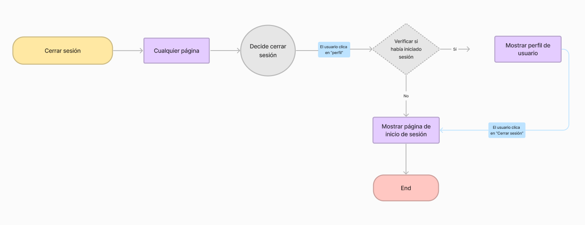
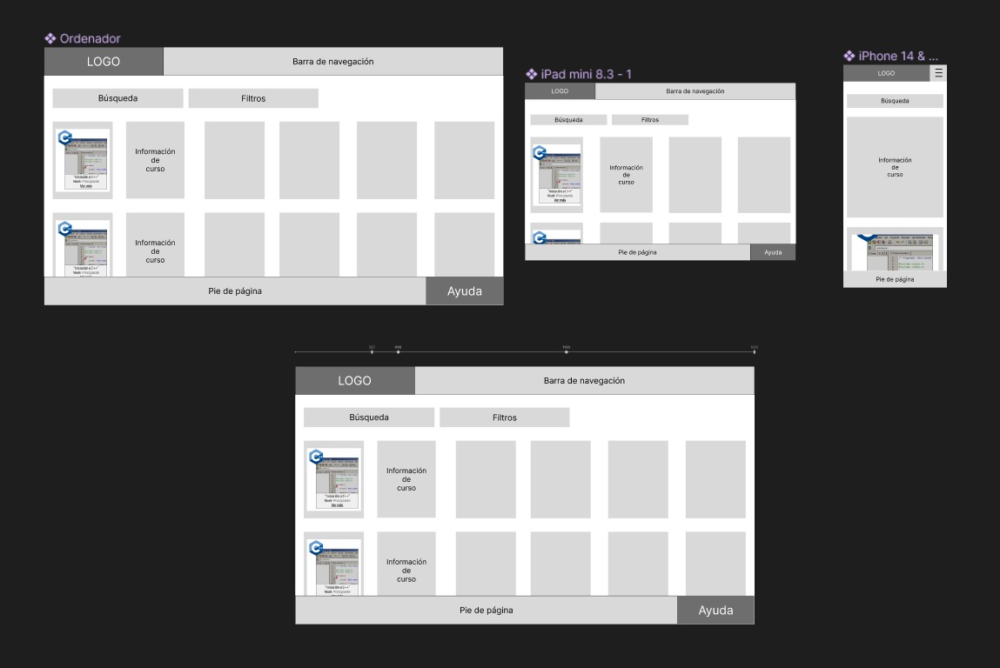

# DIU24
Prácticas Diseño Interfaces de Usuario 2023-24 (Tema: .... ) 

Grupo: DIU1_UX!-I-did-it-again.  Curso: 2023/24 
Updated: 16/3/2024

Proyecto: 
>>> Decida el nombre corto de su propuesta en la práctica 2 

Descripción: 

>>> Describa la idea de su producto en la práctica 2 

Logotipo: 
>>> Opcionalmente si diseña un logotipo para su producto en la práctica 3 pongalo aqui

Miembros
 * :bust_in_silhouette:   Mario López Quesada     :octocat:     
 * :bust_in_silhouette:  Julia María Cano Flores     :octocat:

----- 

# Proceso de Diseño 

## Paso 1. UX User & Desk Research & Analisis 

 **1.a User Reseach Plan**
-----

>>>  Con este documento hemos podido establecer unos objetivos claros que nos motiven a hacer este estudio. Además, hemos especificado las herramientas que vamos a utilizar para evaluar la usabilidad y poder encontrar posibles mejoras. Entre ellas, podemos destacar la etnografía y las encuestas de usabilidad. Nos centraremos en mejorar la utilidad, aprendizaje, satisfacción y persuasión del diseño del sitio web, ya que son cruciales a la hora de obtener unos beneficios. Con todo esto y habiendo analizado los posibles clientes de la web a evaluar, procederemos con cada una de las partes de este estudio. 
>>>  Enlace al archivo: [User Research Plan](P1/User%20Research%20Plan.pdf).

 1.b Competitive Analysis
-----

>>>  Para realizar el análisis de competidores, hemos elegido otras dos compañías de teatro que ofrecen servicios similares a los que ofrece el Espacio La Estupenda. El primero es La Petite, un grupo de artes escénicas de Granada. La elegimos porque consideramos que comparándola con ella, La Estupenda podría sacar a relucir sus virtudes, ya que el contenido aparece bastante desorganizado y es de difícil acceso, además de contar con una velocidad de navegación muy lenta. Por otro lado, elegimos el Espacio La Ventana, una compañía de formación teatral en Madrid, que consideramos, cuenta con una página web bastante buena, y cuyas virtudes podrían servir como referentes a la hora de determinar las debilidades de la página web de La Estupenda. En conclusión, podríamos decir que la comparación acabó siendo fructífera, al evidenciar aquellos aspectos de La Estupenda que necesitan - más o menos urgentemente - intervención o rediseño, entre ellos, la velocidad de carga de la interfaz o la interacción entre el usuario y esta.

 1.c Persona
-----

>>> **Persona 1 - Lara**: Hemos decidido representar a una estudiante de 21 años ya que representa una gran parte del público potencial de dicha empresa. Es usual que los estudiantes busquen actividades diferentes con las que poder despejarse y salir de la rutina. Por ello mismo, hemos decidido que era importante incluir una persona de estas características en nuestro estudio. 

>>> **Persona 2 - Lucas**: Como segunda persona, decidimos representar a Lucas Petrov, un asistente de biblioteca de 35 años apasionado por la literatura. Lucas sufre síndrome de Asperger, lo que dificulta su integración social en diferentes ámbitos, como los grupos de teatro. Ya ha tenido experiencias negativas en este aspecto, y se siente un poco reticente ante la idea de volver a intentarlo, pero es consciente de que si encuentra una buena compañía que ofrezca contenidos adaptados a sus necesidades, su capacidad de interacción social y su ansiedad ante situaciones en las que pueda estar condicionado por su síndrome disminuirán.

 1.d User Journey Map
----

>>> [Journey Map Lara](P1/Persona%201%20-%20Lara%20con%20su%20Journey%20Map.pdf): Este journey map representa el procedimiento de cómo reservar una entrada para un espectáculo del Espacio La Estupenda. Como hemos podido observar, 
al intentar reservar la entrada para el espectáculo, Lara no consigue hacerlo ya que no se encuentra disponible la venta de entradas en ese momento. Esto muestra que la página está desactualizada y no ofrece los servicios que promete. 

>>> [Journey Map Lucas](P1/Persona%202%20-%20Lucas%20con%20su%20Journey%20Map.pdf): El journey map de Lucas representa su intento - fructífero tras algunas decepciones - de reservar un curso de Iniciación a lmprovisación. Consideramos que es interesante ya que evidencia lo ortopédico del proceso de reserva, que necesariamente ha de realizarse mediante formularios, la poca información relativa a la inclusión de personas con necesidades especiales que se incluye en las descripciones de los talleres, y la ansiedad que puede provocar el hecho de no recibir una respuesta inmediata la hora de reservar, ya que siquiera se muestran las plazas disponibles en los talleres.

 1.e Usability Review
----

>>> - Enlace al documento:  [Usability Review](P1/Usability%20review%20-%20La%20Estupenda.xlsx%20-%20Usability%20scores.pdf)
>>> - Valoración final (numérica): 63 - Moderate.
>>> - Comentario sobre la valoración:  Nuestro análisis de la web del Espacio La Estupenda identifica áreas críticas a mejorar. La barra de navegación carece de consistencia, dificultando la búsqueda de información. Para reservar cursos, los usuarios se ven obligados a completar un formulario de contacto y esperar una respuesta, en lugar de ofrecer un método de reserva directa. Además, la interfaz de la tienda online, junto con algunas de sus funciones, como la creación de cuentas de usuario, presenta discrepancias con el resto del sitio, lo que puede causar confusión entre los usuarios. La visualización de eventos sin entradas disponibles resulta poco clara. La lentitud del sitio y la falta de opción para crear una cuenta directamente son preocupaciones adicionales. Consideramos que se requiere una revisión integral para garantizar una experiencia de usuario más fluida y satisfactoria.

## Paso 2. UX Design  

 2.a Reframing / IDEACION: Feedback Capture Grid / EMpathy map 
----

>>> Malla receptora de información (enlace al archivo: [Feedback Capture Grid](P2/Malla%20receptora%20de%20información.pdf)).

  
    
>>> Nuestra plataforma de cursos de programación ofrece una experiencia integral, permitiendo a los usuarios reservar cursos por una 
tarifa accesible. Ofrecemos una amplia variedad de horarios para adaptarnos a sus necesidades, asegurando flexibilidad en la asistencia
a clase. Priorizamos la calidad del contenido, proporcionando cursos ofrecidos por expertos en las materias. Además, organizamos eventos
para enriquecer aún más el proceso de aprendizaje y fomentar la interacción entre los estudiantes y los profesionales de la industria. Con
nuestra plataforma, "Hello World!", los usuarios podrán avanzar en su desarrollo profesional de manera efectiva, y aprovechando al máximo 
su inversión y su tiempo.

 2.b ScopeCanvas
----
>>> Propuesta de valor (enlace al archivo: [Scope Canvas](P2/scope_canvas.pdf).)

 2.b User Flow (task) analysis 
-----

>>> Task Analysis (enlace al archivo: [Task Analysis](P2/Task%20Analysis.pdf)).

>>> User Flow 1: "Crear una nueva cuenta" (enlace al archivo: [User Flow 1](P2/user-flow1.pdf)).

>>> User Flow 2: "Cerrar sesión" (enlace al archivo: [User Flow 2](P2/user-flow2.pdf)).

>>> User Flow 3: "Apuntarse a un curso" (enlace al archivo: [User Flow 3](P2/user-flow3.pdf)).

>>> Definir "User Map" y "Task Flow" ... 

 2.c IA: Sitemap + Labelling 
----

>>> Al comienzo realizamos el siguiente Sitemap (enlace al archivo: [User flow - Site map](P2/userflow-sitemap.pdf)), que terminó convirtiéndose en una mezcla de User flow y Sitemap. Además, consideramos un ámbito demasiado amplio teniendo en cuenta el tiempo que tenemos para el desarrollo de la práctica.

Por ello, incluímos además el siguiente Sitemap, que será el que consideraremos como oficial:

En amarillo, se destacan las páginas que bocetaremos.

>>> Identificar términos para diálogo con usuario: labelling (enlace al archivo: [Labelling](P2/labelling.pdf)).

 2.d Wireframes
-----

>>> Para este apartado, realizamos en primer lugar dos esbozos en papel: uno para el catálogo de cursos y otro para la descripción de un curso:

Boceto a mano para el catálogo de cursos:

Boceto a mano para la descripción de un curso:

>>> A continuación, utilizamos Figma para crear un modelo jerarquizado de nuestro diseño (wireframing) para ordenador, con posiciones fijas:

Enlace al wireframing del catálogo: [Archivo "wireframing" del catálogo](P2/Wireframing%20-%20Catálogo%20de%20cursos.fig)

Enlace al wireframing de la descripción del curso: [Archivo "wireframing" de la descripción](P2/Wireframe%20descripción%20curso.fig)

>>> Una vez que tuvimos claro el diseño que queríamos desarrollar, utilizamos Figma de nuevo para replicar nuestros wireframing, pero incluyendo un diseño para tablet y uno para móvil, además del de ordenador. Una vez conseguimos que fuesen responsive (haciendo uso de los *constraints* Scale, y de los auto layout (Shift + A), hicimos uso del plugin *Breakpoint* para simular cómo se verían las transiciones entre el diseño para unas dimensiones y los demás.

Enlace al wireframing *responsive* del catálogo: [Archivo "wireframing responsive" del catálogo](P2/Wireframing%20Responsive%20-%20Catálogo%20de%20cursos.fig)

Enlace al wireframing *responsive* de la descripción del curso: [Archivo "wireframing responsive" de la descripción](P2/Wireframing%20Responsive%20-%20Descripción%20del%20curso.fig)

## Paso 3. Mi UX-Case Study (diseño)

 3.a Moodboard
-----

>>>  Enlace al archivo: [MoodBoard](P3/MoodBoard.pdf).

  3.b Landing Page
----

Hemos realizado la versión para ordenador y la versión para móvil

>>> Enlace al archivo: [Landing Pages](P3/LandingPages.pdf)

 3.c Guidelines
----

>>> En nuestro proyecto de aplicación de formación de cursos de programación online, hemos implementado una serie de patrones y guías de diseño clave para mejorar la experiencia del usuario. Estos incluyen una navegación intuitiva con una navBar adaptada a dispositivos móviles, una página de Onboarding para introducir a los usuarios en la plataforma, y un Hero image con Carousel para llamar la atención del usuario. También hemos añadido un sistema de búsqueda eficiente, Wizards para guiar a los usuarios a través de procesos complejos mediante un chat, y una lista de artículos en formato de tarjetas para una fácil visualización. Cada elemento tiene su propia página de detalles con acciones específicas y un sistema de confirmación de pago. Además, hemos implementado pantallas de registrar y login amigables y una página donde poder ver su perfil y sus cursos actuales.

  3.d Mockup
----

>>> Enlace a los frames en PDF: [Frames Layout PDF](P3/FramesLayout.pdf)

>>> Enlace al vídeo tutorial del uso de nuestra interfaz: https://drive.google.com/uc?id=1Kszi9irAVQJd8Tt0whIOAk3NnKRpzO7U&export=download

>>> Enlace al archivo Figma: [Layout](P3/Layout.fig)

 3.e ¿My UX-Case Study?
-----

>>> Publicar my Case Study en Github..
>>> Documente y resuma el diseño de su producto

## Paso 5. Exportación & evaluación con Eye Tracking 

Exportación a HTML/Flutter
-----

)  5.b Eye Tracking method 

>>> Indica cómo diseñas experimento y reclutas usuarios (uso de gazerecorder.com)  

Diseño del experimento 
----

>> Uso de imágenes (preferentemente) -> hay que esablecer una duración de visualización y  
>> fijar las áreas de interes (AoI) antes del diseño. Planificar qué tarea debe hacer el usuario (buscar, comprar...) 

  
>> cambiar img por tu diseño de experimento  

>> Recordar que gazerecorder es una versión de pruebas: usar sólo con 3 usuarios para generar mapa de calor (recordar que crédito > 0 para que funcione) 

Resultados y valoración 
-----

>> Cambiar por tus resultados
  

## Paso 4. Evaluación 

 4.a Caso asignado
----

>>> Breve descripción del caso asignado con enlace a  su repositorio Github

 4.b User Testing
----

>>> Seleccione 4 personas ficticias. Exprese las ideas de posibles situaciones conflictivas de esa persona en las propuestas evaluadas. Asigne dos a Caso A y 2 al caso B
 

| Usuarios | Sexo/Edad     | Ocupación   |  Exp.TIC    | Personalidad | Plataforma | TestA/B
| ------------- | -------- | ----------- | ----------- | -----------  | ---------- | ----
| User1's name  | H / 18   | Estudiante  | Media       | Introvertido | Web.       | A 
| User2's name  | H / 18   | Estudiante  | Media       | Timido       | Web        | A 
| User3's name  | M / 35   | Abogado     | Baja        | Emocional    | móvil      | B 
| User4's name  | H / 18   | Estudiante  | Media       | Racional     | Web        | B 

 4.c Cuestionario SUS
----

>>> Usaremos el **Cuestionario SUS** para valorar la satisfacción de cada usuario con el diseño (A/B) realizado. Para ello usamos la [hoja de cálculo](https://github.com/mgea/DIU19/blob/master/Cuestionario%20SUS%20DIU.xlsx) para calcular resultados sigiendo las pautas para usar la escala SUS e interpretar los resultados
http://usabilitygeek.com/how-to-use-the-system-usability-scale-sus-to-evaluate-the-usability-of-your-website/)
Para más información, consultar aquí sobre la [metodología SUS](https://cui.unige.ch/isi/icle-wiki/_media/ipm:test-suschapt.pdf)

>>> Adjuntar captura de imagen con los resultados + Valoración personal 

 4.d Usability Report
----

>> Añadir report de usabilidad para práctica B (la de los compañeros)

>>> Valoración personal 

5.) Conclusion de EVALUACION (A/B testing + usability report + eye tracking) 
----

>> recupera el usability report de tu práctica (que es el caso B de los asignados a otros grupos) 
>> con los resultados del A/B testing, de eye tracking y del usability report:
>>  comentad en 2-3 parrafos cual es la conclusion acerca de la realización de la práctica y su evaluación con esas técnicas y que habéis aprendido

## Conclusión final / Valoración de las prácticas

>>> (90-150 palabras) Opinión FINAL del proceso de desarrollo de diseño siguiendo metodología UX y valoración (positiva /negativa) de los resultados obtenidos  

